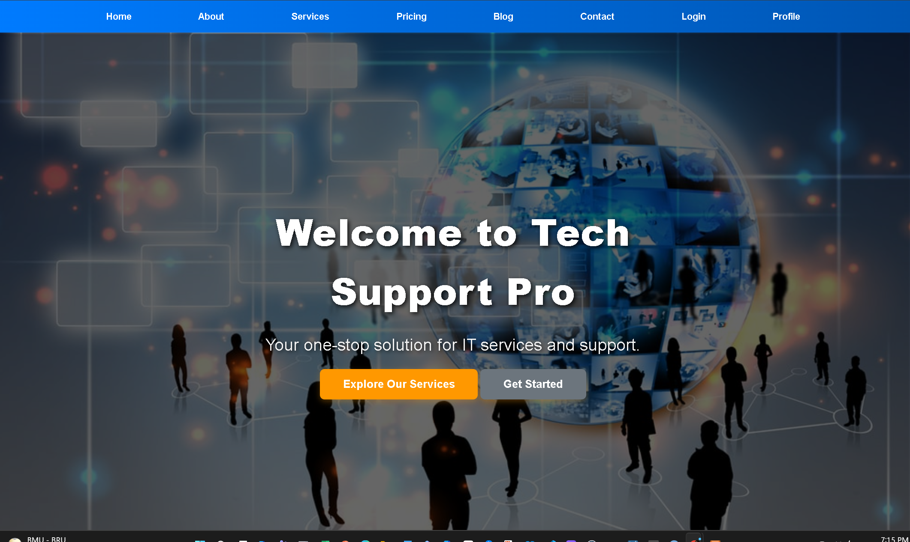
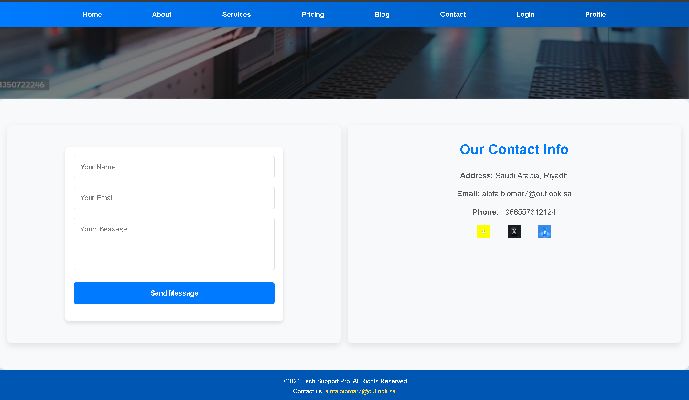
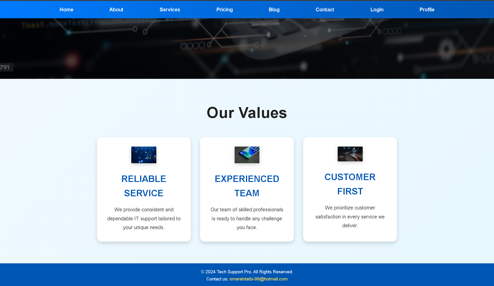

# tech-support-pro
Full-stack PHP/MySQL customer support system with admin dashboard, secure login, and workflow automation.
# Tech Support Pro 🖥️  
A full-stack customer support and ticket management platform built with **PHP**, **MySQL**, **HTML**, and **CSS**.  
The system enables users to submit support tickets, while admins can manage, reply, and track issues through a secure dashboard.

---

### 👤 User Dashboard
- Secure login and registration system.
- Automatically assigned **User role** upon signup.
- Users can **create new support tickets** and track them through **four stages**:
  - `Submitted`
  - `In Progress`
  - `Resolved`
  - `Closed`
- Profile management (update info, view ticket history, etc.).

  ### 🧑‍💼 Admin Dashboard
- Admin accounts are created or promoted **directly through the database** for security.
- Admins can:
  - View and manage all user tickets.
  - **Update ticket status** (affects user dashboard view in real time).
  - Reply to user messages.
  - Access analytics and summary data.
- Separate admin interface (`admin.php`, `dashboard.php`).
---

### 📰 Website Modules
- **Home Page** (`index.php`)
- **Services** (`services.php`)
- **Blog** (`blog.php`, `view_blog.php`)
- **Contact Form** (`contact.php`, `email_config.php`)
- **Pricing**, **About**, **Profile**, and more.
---

### 🗄️ Database & Architecture
- **Database:** `tech_support_db`
- **Role Management:** user / admin  
- **Ticket Lifecycle:** stored in `tickets` table with status updates  
- **Normalization:** up to 3NF  
- **Security:** password hashing, session management, and access validation

  --- 
  ## 🧩 Tech Stack
| Layer | Technologies |
|-------|---------------|
| **Frontend** | HTML, CSS, Bootstrap |
| **Backend** | PHP (Procedural) |
| **Database** | MySQL |
| **Server** | Apache (XAMPP) |
| **Version Control** | Git, GitHub |

---

## ⚙️ Technologies Used
**Frontend:** HTML, CSS, Bootstrap  
**Backend:** PHP (Procedural)  
**Database:** MySQL  
**Server:** Apache (XAMPP)  
**Version Control:** Git, GitHub  

---
## 💡 Key Highlights
- ✅ **Fully Developed Web Application** — complete front-end, back-end, and database integration.
- ✅ **Role-Based Access Control (RBAC)** — user vs. admin roles managed securely through database privileges.
- ✅ **User Dashboard** — users can create, view, and track tickets through four stages: *Submitted*, *In Progress*, *Resolved*, *Closed*.
- ✅ **Admin Dashboard** — admins can change ticket status, reply to users, and monitor workflow analytics.
- ✅ **Real-Time Ticket Synchronization** — user views update dynamically as admins modify ticket states.
- ✅ **Multi-Module System** — includes Home, Services, Blog, Contact, Pricing, Profile, Login, Register, and more.
- ✅ **Database-Driven Role Promotion** — new registrants default to “user” and can be promoted to “admin” directly from the database.
- ✅ **Secure Authentication** — password hashing, session management, and input validation.
- ✅ **Email Configuration** — automatic email notifications via `email_config.php`.
- ✅ **Responsive Design** — mobile-friendly pages built with Bootstrap for consistent UI/UX.
  
## 🚀 Future Improvements

- 🔄 **Migrate to MVC Framework (Laravel)** to enhance maintainability and scalability.
- 🧠 **Add AI Chatbot Support** for automated user ticket replies using NLP.
- 📊 **Integrate Analytics Dashboard** for admin (powered by Chart.js or Power BI).
- ✉️ **Enable Email & SMS Notifications** for status updates.
- 🔐 **Implement JWT Authentication** for API access and third-party integrations.
- ☁️ **Deploy to AWS or Render** using EC2 and RDS for real-world cloud hosting.
- 📱 **Develop Mobile App Companion** using React Native or Flutter for user convenience.
- 💾 **Add Backup & Audit Logging System** for ticket history and compliance tracking.
--
## 📸 Project Screenshots

### 🏠 Home Page

### 🧾 Contact Page

### 📰 Blog Page

### 🛠️ Services Page

---

## 🧑‍💻 How to Run
1. Install **XAMPP** 
2. Place project folder inside `/htdocs`  
3. Start Apache & MySQL  
4. Import `tech_support.sql` into phpMyAdmin  
5. Visit `http://localhost/tech-support-pro`

---

## 📬 Contact
Developed by **Omar Alotaibi**  
📧 [alotaibiomar7@outlook.sa](mailto:alotaibiomar7@outlook.sa)  
🌐 [LinkedIn](https://www.linkedin.com/in/omar-alotaibi11071998/) | [Credly]([https://credly.com](https://www.credly.com/users/omar_alotaibi))
